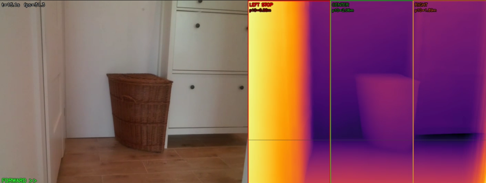
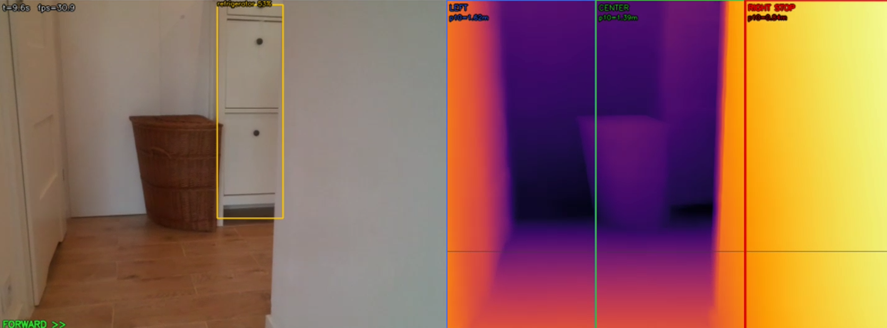
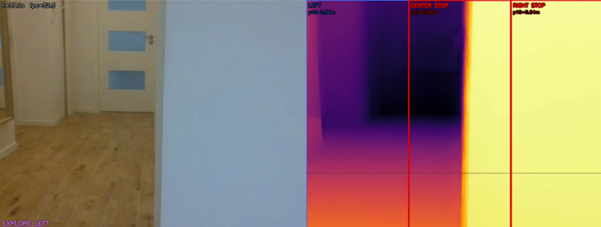

# Agent Tello

Offline physical AI agent for DJI/Ryze Tello.

Author: Tomasz Wietrzykowski.

Agent Tello turns a low-cost educational drone into a local embodied AI agent. It can fly indoors using real-time monocular depth estimation, avoid nearby obstacles, follow open space, listen to English voice commands, speak back, describe its own camera view, and search for objects using YOLO plus a local Ollama vision model.

The system is designed for developers, schools, robotics clubs, AI educators, and local AI experiments. It does not use cloud APIs during flight.

## What It Can Do

- Autonomous indoor exploration using a live estimated depth map.
- Smooth forward flight with reactive yaw control.
- Local obstacle avoidance around walls, furniture, doors, windows, mirrors, screens, corners, tables, and chairs.
- Depth-only autonomous mode without any LLM.
- Full voice agent mode with English speech input and speech output.
- Local Ollama integration for command interpretation and visual description.
- Object search with YOLO for common classes such as person, chair, bottle, laptop, TV, cat, dog, table, and similar COCO objects.
- Vision model fallback for open-ended questions and non-COCO targets.
- Flight logs with events, depth metrics, RC commands, mission state, and failures.

## Tested Hardware

This release was tested on:

- Laptop: Lenovo Legion Pro class machine.
- GPU: NVIDIA RTX 4080 Laptop GPU.
- VRAM: 12 GB.
- Drone: DJI/Ryze Tello.
- Audio: Samsung Galaxy Buds FE Bluetooth headset, plus laptop microphone and speaker fallback.
- Environment: indoor apartment, daylight, corridors, rooms, open doors, furniture, glass, mirrors, windows, and screens.

## Recommended Hardware

For the full voice and vision agent:

- Windows 10 or Windows 11.
- Python 3.11.
- NVIDIA GPU with CUDA support.
- 8 GB VRAM minimum recommended.
- 12 GB VRAM recommended for smoother depth plus vision model usage.
- 16 GB system RAM minimum, 32 GB recommended.
- DJI/Ryze Tello connected over the Tello Wi-Fi network.
- Local Ollama installation.
- At least one local Ollama vision model.

Depth-only navigation can run with less memory, but the full agent is intended for a CUDA laptop or desktop GPU.

## Safety First

This is a real flying robot. It can injure people, damage objects, or crash.

- Fly indoors only in a clear test area.
- Use good daylight or bright, stable indoor lighting.
- Keep people, pets, fragile objects, open windows, liquids, and faces away from the flight path.
- Keep the battery above 50 percent while testing.
- Keep one hand near the keyboard for Ctrl+C or emergency landing.
- Do not fly near stairs, balconies, open windows, or crowded rooms.
- Do not use this software for safety-critical operation.
- Tello has a narrow field of view, Wi-Fi latency, no real SLAM, and no hardware obstacle sensors.
- Monocular depth is an estimate, not a measurement guarantee.

The software reduces risk, but it does not guarantee collision-free flight.

## Repository Contents

```text
src/
  agent/                 Local speech, Ollama, and mission logic
  navigation/            Reactive depth navigation policy
  perception/            Depth, sector metrics, YOLO hazard detection
  control_loop.py        RC loop and safety stop handling
  tello_client.py        Tello command and state wrapper
  video_stream.py        Latest-frame video stream
  telemetry.py           Logs and emergency exit helpers

scripts/
  s5_forward_yaw.py      Depth-only autonomous flight
  s6_voice_test.py       Microphone and speaker test
  s7_voice_agent.py      Full voice, vision, and flight agent
  s7_audio_devices.py    Audio device listing
  s7_mic_meter.py        Microphone level meter
  download_yolo.py       YOLO model downloader
  download_whisper.py    Whisper model downloader

install.ps1         Windows setup script
run_depth_only.ps1  Depth-only launcher
run_agent.ps1       Full agent launcher
requirements.txt    Python dependencies
LICENSE.md               Proprietary commercial license
```

## Screenshots

Live drone camera, estimated depth view, object detections, and flight telemetry:





## Installation

Open PowerShell inside the project folder.

If PowerShell blocks local scripts, run:

```powershell
Set-ExecutionPolicy -Scope Process -ExecutionPolicy Bypass
```

Install Python dependencies and local assets:

```powershell
.\install.ps1
```

The installer creates `.venv`, installs Python dependencies, downloads the YOLO model if needed, downloads a faster-whisper model if needed, and prepares an English Piper voice if available.

## Ollama Models

Install Ollama separately, then pull the recommended local models:

```powershell
ollama pull gemma4:e4b
ollama pull qwen2.5vl:3b
```

Default roles:

- Brain model: `gemma4:e4b`
- Vision model: `qwen2.5vl:3b`

You can change both from the command line.

## Before Every Flight

1. Charge the Tello battery.
2. Place the drone in a safe, open indoor area.
3. Turn on the drone.
4. Connect the computer to the Tello Wi-Fi network.
5. Make sure the room has good lighting.
6. Keep the keyboard close.
7. Start with a short test flight.

## Depth-Only Autonomous Flight

This is the core flight mode. It does not use Ollama or voice control.

Recommended launcher:

```powershell
.\run_depth_only.ps1
```

Longer flight:

```powershell
.\run_depth_only.ps1 -Duration 180
```

Direct Python command:

```powershell
.\.venv\Scripts\python.exe scripts\s5_forward_yaw.py --duration 60
```

What to expect:

- Tello takes off.
- The depth pipeline warms up.
- The drone starts moving forward and steering toward open space.
- It slows down near obstacles.
- It turns when it reaches a wall, corner, or dead end.
- It lands after the selected duration or when interrupted.

Press `q` in the preview window or press `Ctrl+C` in PowerShell to stop and land.

## Full Voice and Vision Agent

This mode adds English voice commands, speech output, object search, camera descriptions, and local Ollama reasoning.

Recommended launcher with default laptop audio:

```powershell
.\run_agent.ps1
```

With selected microphone and speaker device IDs:

```powershell
.\run_agent.ps1 -MicDevice 30 -SpeakerDevice 29
```

Direct Python command with default audio:

```powershell
.\.venv\Scripts\python.exe scripts\s7_voice_agent.py --model gemma4:e4b --vision-model qwen2.5vl:3b --agent-interval 3 --listen-input-warmup 1.0
```

Direct Python command with selected audio devices:

```powershell
.\.venv\Scripts\python.exe scripts\s7_voice_agent.py --model gemma4:e4b --vision-model qwen2.5vl:3b --agent-interval 3 --mic-device 30 --speaker-device 29 --listen-input-warmup 1.0
```

## Audio Setup

List audio devices:

```powershell
.\.venv\Scripts\python.exe scripts\s7_voice_agent.py --list-audio-devices
```

Test default microphone and speaker:

```powershell
.\.venv\Scripts\python.exe scripts\s6_voice_test.py --seconds 6
```

Test a selected microphone and speaker:

```powershell
.\.venv\Scripts\python.exe scripts\s6_voice_test.py --mic-device 30 --speaker-device 29 --seconds 6
```

If a Bluetooth headset cuts off the beginning of speech, use `--listen-input-warmup 1.0` in the full agent command.

## Example Voice Commands

- `Take off.`
- `Land.`
- `Stop.`
- `Hover.`
- `Fly around.`
- `Explore.`
- `Find a chair.`
- `Find a person.`
- `Find a bottle.`
- `Find the kitchen.`
- `Describe what you see.`
- `Turn left.`
- `Turn right.`
- `Move forward.`
- `Move back.`
- `Go up.`
- `Go down.`
- `Emergency stop motors.`

Safety commands such as `land`, `stop`, and `emergency stop motors` are handled by a deterministic parser before the LLM.

## Architecture

```text
Tello camera
  -> latest-frame video stream
  -> depth pipeline
  -> temporal smoother
  -> sector metrics
  -> reactive yaw policy
  -> RC command

Tello camera
  -> YOLO detector
  -> mission agent
  -> found target event
  -> stop autonomous flight

Microphone
  -> faster-whisper
  -> deterministic command parser
  -> Ollama command fallback
  -> safe tool execution

Camera snapshot
  -> Ollama vision model
  -> first-person Tello answer
  -> Piper TTS or Windows TTS
```

The flight controller is separated from the LLM. The depth navigation loop stays fast and deterministic. The LLM and VLM act as a slower high-level layer for language, descriptions, and mission interpretation.

## Logs

Logs are written under `logs/`.

Useful files:

- `events.jsonl`: events, decisions, errors, mission state.
- `samples.csv`: navigation samples and depth sector metrics.
- `s7_vlm_last.jpg`: latest frame sent to the vision model.

Logs are not intended for GitHub commits.

## Troubleshooting

### The drone does not take off

- Make sure the computer is connected to the Tello Wi-Fi network.
- Check that the battery is charged.
- Restart the drone and reconnect Wi-Fi.
- Run a short basic test before autonomy.

### There is no camera image

- Reconnect to the Tello Wi-Fi network.
- Restart the script.
- Make sure no other app is using the Tello video stream.

### Ollama is slow

- Use a smaller vision model, for example `qwen2.5vl:3b`.
- Reduce other GPU load.
- Use depth-only mode for navigation tests.

### Voice commands are not recognized

- List devices with `--list-audio-devices`.
- Test the microphone with `scripts\s6_voice_test.py`.
- Use a closer microphone or a headset.
- Try `--listen-input-warmup 1.0` for Bluetooth headsets.

### The drone flies too cautiously

- Use better lighting.
- Avoid reflective floors and featureless white walls for first tests.
- Start in a wider room before corridors.
- Keep the flight duration short while tuning.

## Commercial License

This product is proprietary commercial software unless you receive a separate written license.

You may not redistribute, resell, sublicense, publish, or share the source code, binaries, trained assets, or modified versions without written permission from the copyright owner.

See `LICENSE.md`.

Third-party dependencies remain under their own licenses. Users are responsible for complying with DJI/Ryze Tello, Ollama, PyTorch, YOLO, Whisper, Piper, and model license terms.

